<!-- CSS styles -->

## 2022

<!-- ADP: ex 2 pt 1,2,3 -->

### Differentiable Physics: a learnable Physics solver 

_[Chair for Graphics and Visualization, TU München](https://www.cs.cit.tum.de/cg/cover-page/)_

- Topic offered by Prof. Thuerey as part of the course _Advanced Deep Learning for Physics_
- Implemented and compared physics solvers based on a given potential landscape. Task: predict the trajectory of a point.
- Implemented a supervised learning solver: it is purely data-driven. Problem: leads to suboptimal solutions in case of multiple solutions.
- A differentiable physics solver: it is a data-driven learnable solver that also incorporates knowledge of the potential landscape. It is more accurate than the supervised technique. 

  

    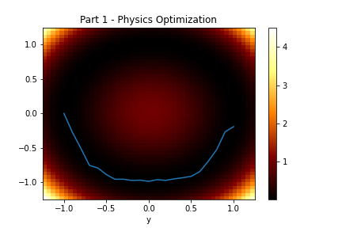
    
 Classic physics optimization in a symmetric potential landscape. Two paths are available depending on the initialization (here shown lower path).

  

  

    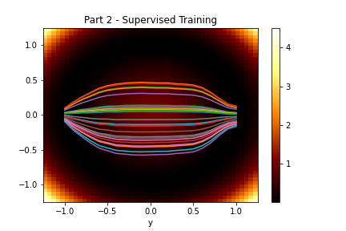
    
 Supervised physics solver. Here shown 25 different paths differing by initial condition. Many paths are sub-optimal. 

  

  

    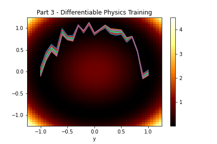
    
 Differentiable physics solver solves the multimodality and chooses only one way paths. Zig-zags can be improved with hyperparameter tuning. 

  

Include three pictures on gdrive.
Maybe change the first picture by including also the upper trajectory.
introduce the phyisics solver: it will provide the baseline here.
comment on zig zag in pic3.

## 2021
<!-- CASE STUDIES: CASCOR -->

### Optimization of Artificial Neural Networks: Cascade Correlation Algorithm

_[Vitesco GmbH](https://www.vitesco-technologies.com/en-us)_ and _[Chair of Numerical Mathematics, TU München ](https://www-m2.ma.tum.de/bin/view/Allgemeines/)_

- Supervised by Dr. T. Köpple, MSc. G.Gutierrez.
- Building an **optimal** Artificial Neural Network (ANN), with a minimal number of layers and neurons, that does not overfit the data.
- Goal: develop an ANN able to run on a small engine processor with a limited amount of memory. The ANN predicts temperature of the vehicle's engine.
- The Cascade Correlation (Cascor) Neural Network is both an architecture and a family of learning algorithms: it begins with a minimal network structure and then trains and **adds automatically units**, one at a time, optimizing residual correlations.

  

    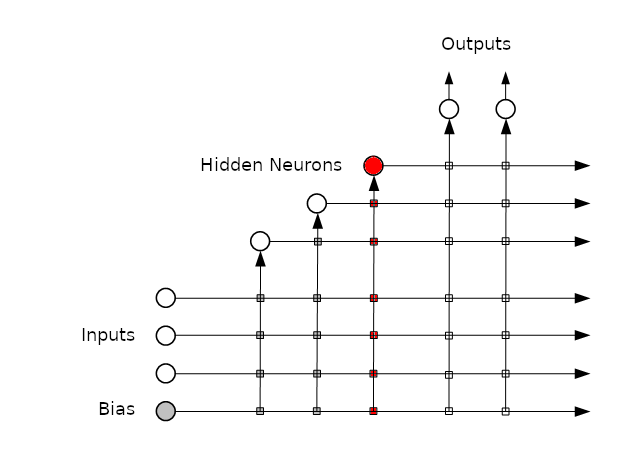
    
 Cascor architecture adds a neuron every epoch and connects it to all previous neurons.

  

  

    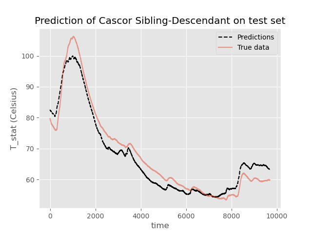
    
 Results of prediction on test data.

  

 pictures: 
prediction (last picture from report), and this pic https://www.google.com/url?sa=i&url=https%3A%2F%2Ftowardsdatascience.com%2Fcascade-correlation-a-forgotten-learning-architecture-a2354a0bec92&psig=AOvVaw22CIi2HetqtBKnFT9qre2W&ust=1665592532396000&source=images&cd=vfe&ved=0CAsQjRxqFwoTCMC17O_N2PoCFQAAAAAdAAAAABAE 

<!-- STATISTICAL LEARNING: EXERCISE 8 -->

### Comparison of simple classifiers

_[Chair of Mathematical Modeling of Biological Systems, TU München](https://www.math.cit.tum.de/math/personen/professuren/theis-fabian/)_

- Topic offered by Prof. Theis as part of the course _Statistical Learning_.
- Comparison of different classifiers: Linear Support Vector Machine (SVM), Radial Basis Function (RBF) SVM, Decision Tree, Random Forest and AdaBoost.
- This exercise shows the limitations of linear classifiers (Linear SVM) against kernel classifiers (RBF SVM) and exposes the overfitting behavior of single classifiers (Decision Trees) against ensemble methods of bagging (Random Forest) and boosting (AdaBoost).

  

    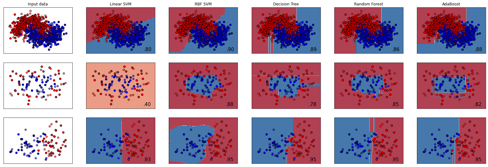
    
 Results of classification for three different toy datasets.

  

 include image of exercise. 

<!-- SIMULATION OF SEMICONDUCTORS PROPERTIES-->

### Investigation of Silicon Properties using the Quantum Espresso simulation environment

_[Associate Professorship Simulation of Nanosystems for Energy Conversion, TU München](https://www.ee.cit.tum.de/sne/home/)_

- Supervised by M. Rinderle, I. Kouroudis. Collaborated with J. Schwend. 
- Performed self-constistent calculations to obtain density of states (DOS) and bandstructure of Silicon.
- Used different types of exchange-correlation functionals to obtain finer results in bandgap calculation.

  

    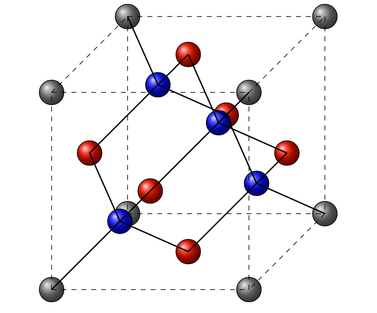
    
 Silicon lattice (fcc).

  

  

    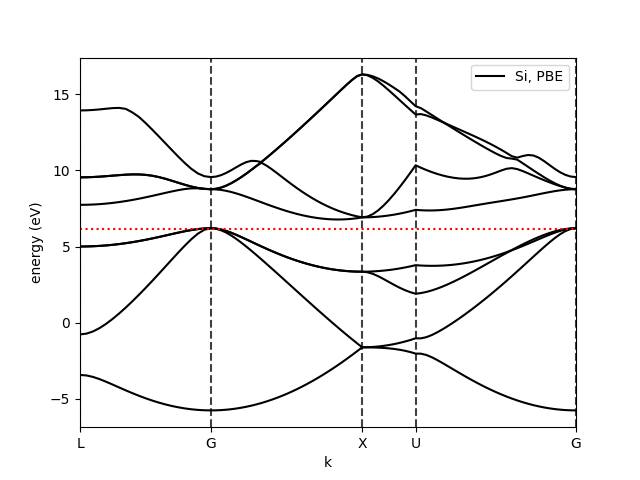
    
 Band structure simulation.

  

  

    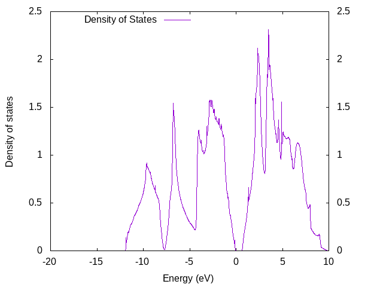
    
 Density of states simulation.

  

include pictures of silicon crystal structure, density of states, bandgap.

## 2019

<!-- BACHELOR THESIS -->

### Study of parameters that influence radiative transfer in the atmosphere

_[Condensed Matter Physics Group, Università degli Studi di Milano](https://www.fisica.unimi.it/ecm/home/ricerca/gruppi-di-ricerca/fisica-della-materia-condensata)_

- Supervised by Prof. Potenza.
- The greatest challenge in climate research is to determine the effect of light when small particles (aerosol) are present in the atmosphere.
- Studied sensibility of diffused irradiance due to presence in the atmosphere of different Antarctic mineral aerosol dust.  
- Carried radiative transfer simulations to determine influence of three crucial aerosol parameters: phase function, extinction cross section and single scattering albedo.

  

    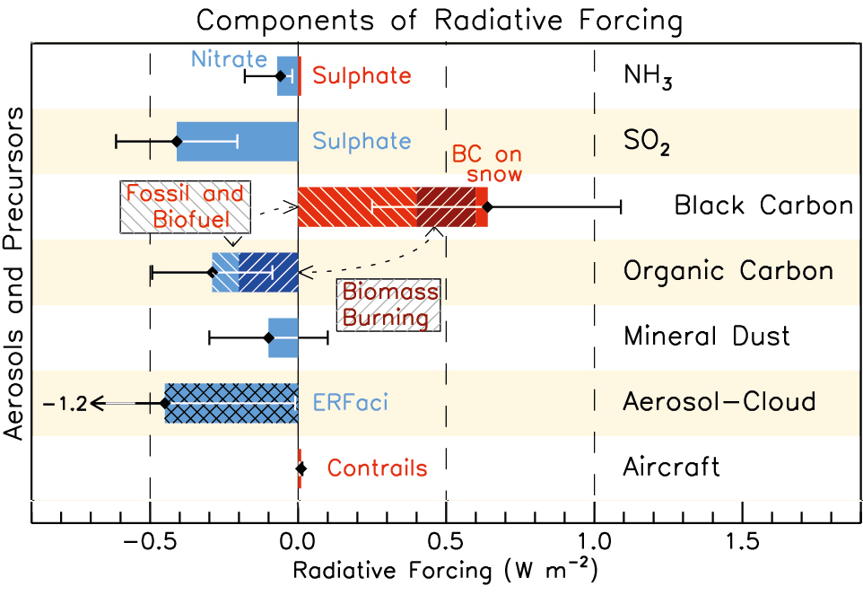
    
 Courtesy of Intergovernmental Panel on Climate Change (IPCC): radiative forcing due to different types of aerosols. High error bars indicate that these effects are not known yet.
     

  

  

    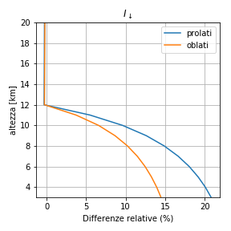
    
 Downward irradiance percentage differences (horizontal axis) at different altitudes (vertical axis). We compare prolate and oblate shapes with a spherical reference shape: maximum at sea-level.  

  

 
image of radiative forcing from IPCC (last part of thesis), and pg. 29 thesis, first figure: relative differences due to different shapes of aerosols influences irradiance, especially at sea level. 

